# 🚀 NiveshIQ

### AI Portfolio Intelligence Engine & Investment Copilot

---

```text
      ┌──────────────────────────────────────────────────────────────┐
      │                        NiveshIQ                              │
      │      AI Portfolio Intelligence & Investment Copilot          │
      ├──────────────────────────────────────────────────────────────┤
      │ • Portfolio Analytics                                        │
      │ • Agentic Financial Research                                 │
      │ • Semantic User Memory                                       │
      │ • Real-Time Market Intelligence                              │
      │ • Streaming AI Responses                                     │
      │ • Explainable Investment Insights                            │
      └──────────────────────────────────────────────────────────────┘
```

---

# ⚙ Technology Stack

| Layer           | Technology               |
| --------------- | ------------------------ |
| Frontend        | Next.js                  |
| Backend         | FastAPI                  |
| Agent Framework | LangGraph                |
| LLM             | Gemini 2.5 flash-lite, flash, pro              |
| Database        | PostgreSQL               |
| Vector Store    | pgvector                 |
| Cache           | Redis                    |
| Search          | DuckDuckGo               |
| Market Data     | yFinance                 |
| Streaming       | Server Sent Events (SSE) |

---

# 🤖 AI Model Tier & Orchestration

NiveshIQ separates tasks across specialized Gemini models and embeddings to balance response quality, analytical depth, and latency.

## Model Roles & Selection

| Model Tier | Model Name | Role in NiveshIQ | Key Capabilities |
| :--- | :--- | :--- | :--- |
| **Lightweight** | Gemini 2.5 Flash Lite | Intent routing, memory classification, structured JSON fact extraction | Ultra-low latency, strict JSON validation, fast decision loops |
| **Agent / Planner** | Gemini 2.5 Flash | Tool planning, function parameter generation, intermediate context summarization | Parallel tool selection, structured schema parsing, tool chaining |
| **Reasoning** | Gemini 2.5 Pro | Strategist node reasoning, compliance review wraps, final explainable chat responses | Long context reasoning, financial domain knowledge, compliance guardrails |
| **Embeddings** | Text-Embedding-004 | Semantic memory vectorization (768 dimensions) | Stable cosine distance calculations, semantic similarity indexing |

## Orchestration Flow

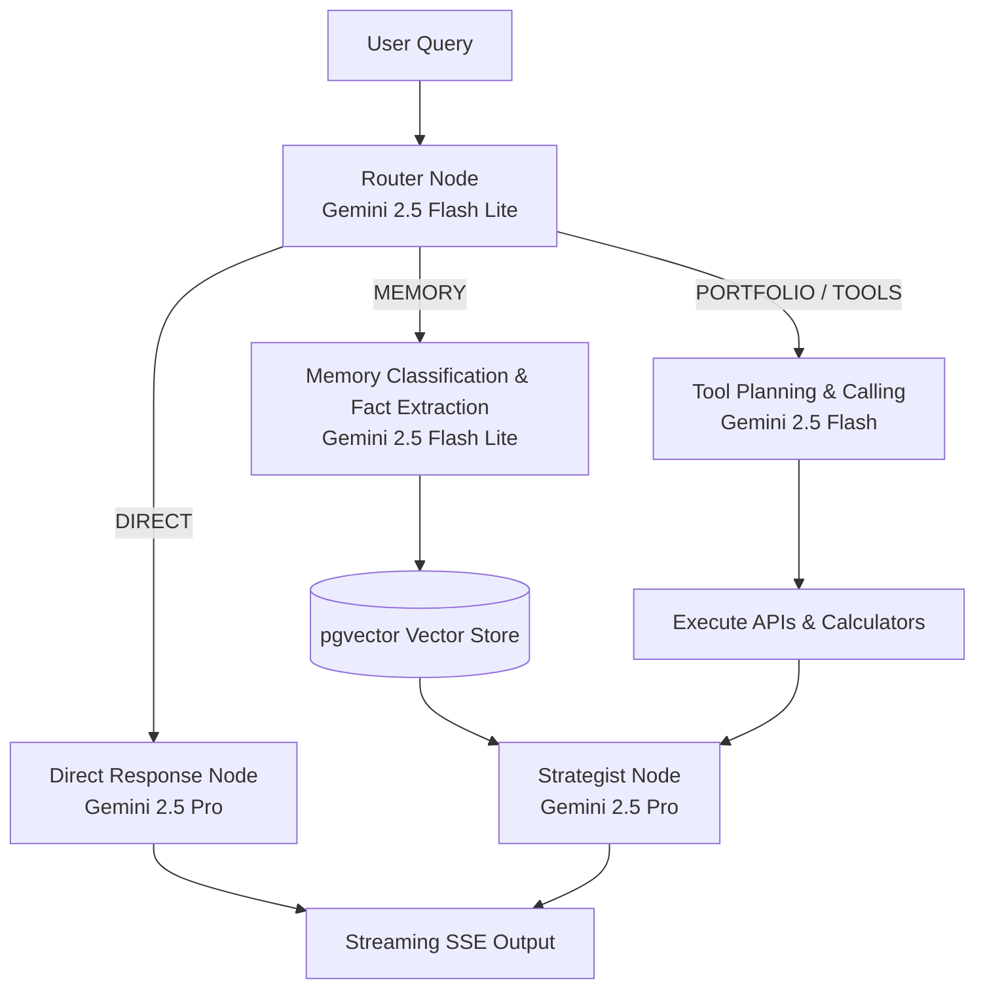

---

# 🧠 Query Routing Architecture

The platform does not execute expensive retrieval for every request.

Every query first passes through a **Retrieval Necessity Router**.

---

## Request Classification Flow

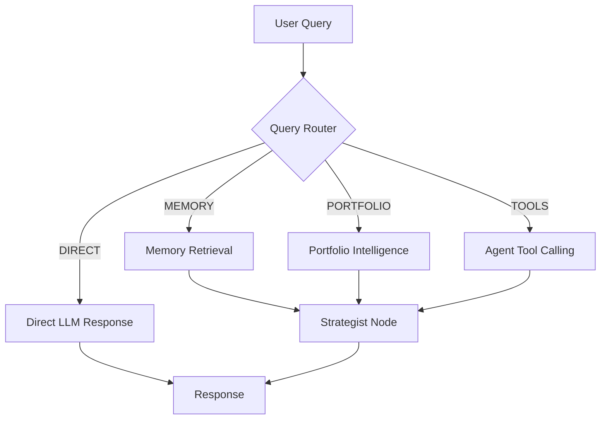

---

## Route Types

### DIRECT

Examples:

```text
Hello

What is CAGR?

Explain SIP

What can you do?
```

No retrieval required.

---

### MEMORY

Examples:

```text
What is my risk appetite?

What stocks do I own?

What was my investment goal?
```

Retrieves:

* User profile
* Semantic memory
* Chat history

---

### PORTFOLIO

Examples:

```text
Review my portfolio

Am I diversified?

Analyze my holdings
```

Retrieves:

* Portfolio holdings
* Allocation data
* Portfolio news

---

### TOOLS

Examples:

```text
Why is Nvidia falling?

Latest AI news

Compare Zerodha and Groww
```

Triggers:

* News search
* Web search
* Market data
* Calculators

---

# 🤖 Agentic Tool Calling

Instead of hardcoded workflows, NiveshIQ uses tool-calling agents.

The LLM decides:

* Which tool to use
* When to use it
* What parameters to pass

---

## Tool Architecture

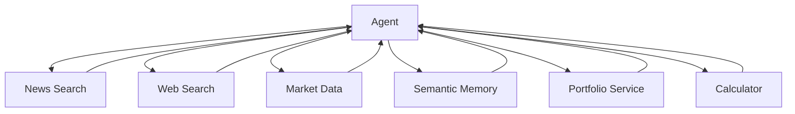

---

## Available Tools

| Tool               | Purpose                  |
| ------------------ | ------------------------ |
| search_news()      | Financial news retrieval |
| web_search()       | General research         |
| get_market_data()  | Live market prices       |
| get_portfolio()    | Holdings analysis        |
| search_memory()    | Semantic memory lookup   |
| get_user_profile() | User profile retrieval   |
| calculator()       | Financial calculations   |

---

# 🧠 Memory Architecture

NiveshIQ implements multi-layer memory.

Each memory layer has a different purpose.

---

## Memory Stack

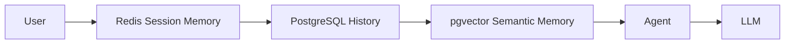

---

## Layer Responsibilities

| Layer        | Purpose                     |
| ------------ | --------------------------- |
| Redis        | Active conversations        |
| PostgreSQL   | Full conversation history   |
| pgvector     | User facts & preferences    |
| User Profile | Structured user information |

---

## Example Semantic Memory

Stored facts:

```text
User invests ₹20,000 monthly

Risk appetite is aggressive

Retirement horizon is 25 years

Owns Tata Motors and HDFC Bank
```

These memories can be retrieved across sessions.

---

# 🧠 pgvector & Semantic Memory Pipeline

NiveshIQ captures, filters, and searches user-specific context across sessions using a robust vector pipeline powered by `pgvector` directly in PostgreSQL.

## 1. Memory Storage Pipeline
Every user chat message is scanned for personally meaningful facts. To prevent database bloat, a deduplication and classification pipeline is executed:

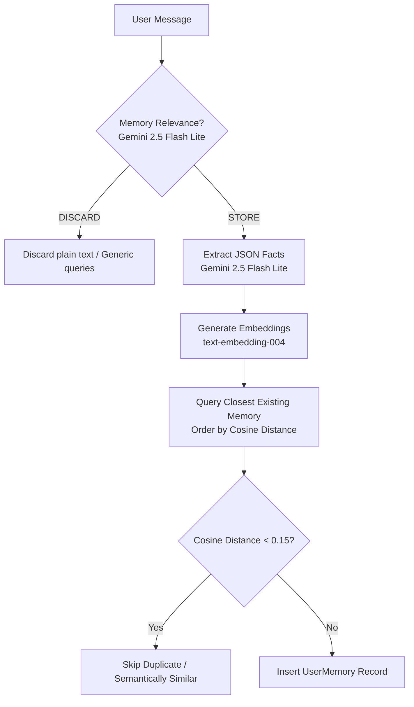

## 2. Memory Retrieval Pipeline
When the Query Router classifies an incoming query as `MEMORY`, relevant facts are dynamically fetched:

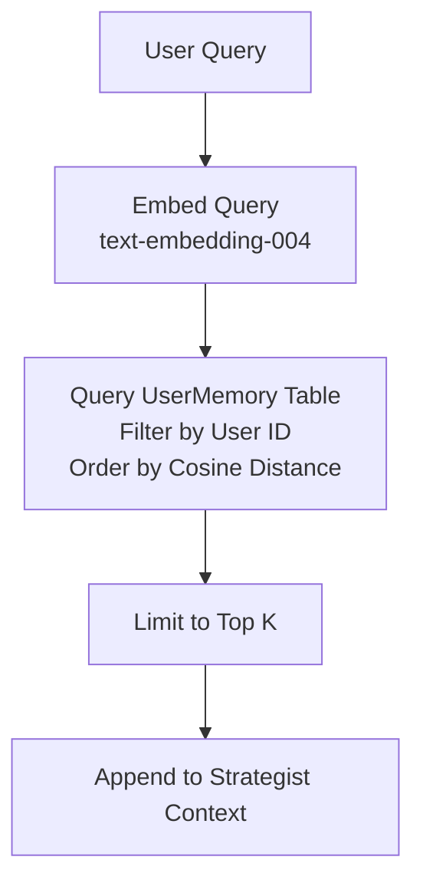

---

# 📊 Portfolio Intelligence Engine

The portfolio engine transforms transaction logs into investment intelligence.

---

## Portfolio Data Flow

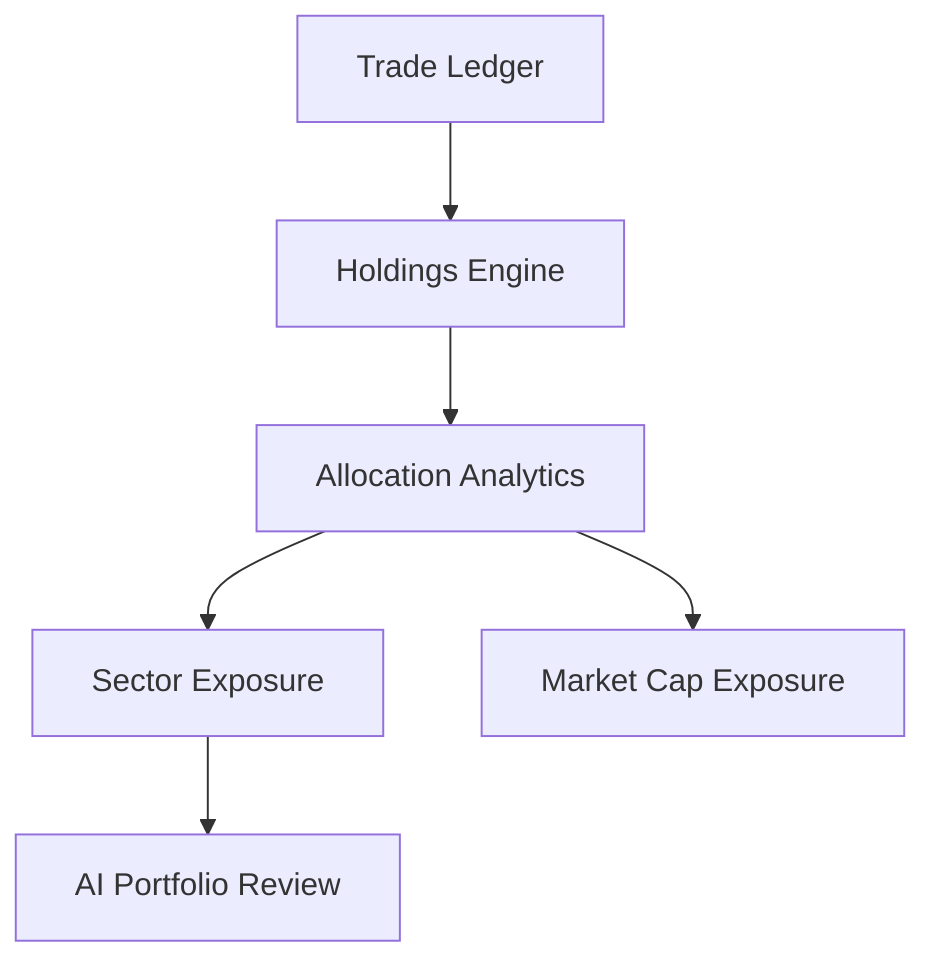

---

## Portfolio Features

| Feature                 | Description                         |
| ----------------------- | ----------------------------------- |
| Holdings Engine         | Weighted average cost tracking      |
| Exposure Analytics      | Sector concentration analysis       |
| Market Cap Distribution | Large/Mid/Small cap breakdown       |
| Historical Performance  | Snapshot-based performance tracking |
| AI Review               | Deep portfolio intelligence         |

---

# ⚡ Caching Architecture

Redis is used to minimize latency and database load.

---

## Cache Flow

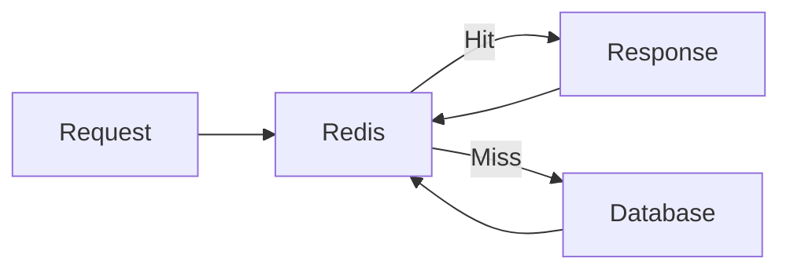

---

## Cache Invalidation

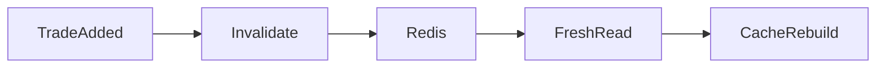


# 🚀 Streaming Architecture

AI responses are streamed token-by-token.

Users receive progress updates before final responses.

---

## Streaming Flow

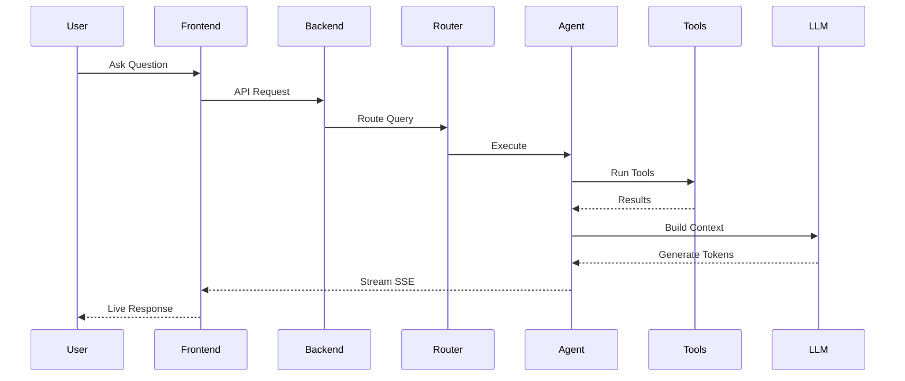

---

# 🔄 Async Execution Model

NiveshIQ uses asynchronous execution extensively.

Benefits:

* Reduced latency
* Parallel retrieval
* Faster AI responses

---

## Parallel Context Retrieval

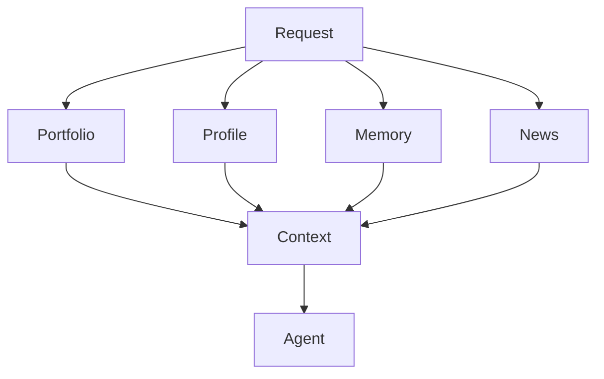

All retrieval operations run concurrently using:

```python
asyncio.gather(...)
```


## AI Copilot

Capabilities:

* Multi-turn conversations
* Tool calling
* Memory retrieval
* Web research
* Portfolio analysis
* Streaming responses

---

# 🛠 Local Development Setup

## Start Redis

```bash
docker run -d --name redis -p 6379:6379 redis
```

---

## Backend

```bash
cd backend

python -m venv .venv

source .venv/bin/activate

pip install -r requirements.txt


python app/main.py
```

---

## Frontend

```bash
cd frontend

npm install

npm run dev
```

---

# 🎯 Design Principles

NiveshIQ is built around five core principles:

1. **Agentic Intelligence** — LLM decides what information is needed.
2. **Minimal Retrieval** — Only fetch what is necessary.
3. **Low Latency** — Redis + Async Execution.
4. **Persistent Memory** — Long-term user understanding.
5. **Explainability** — Every recommendation remains transparent and auditable.

---

## Final Architecture

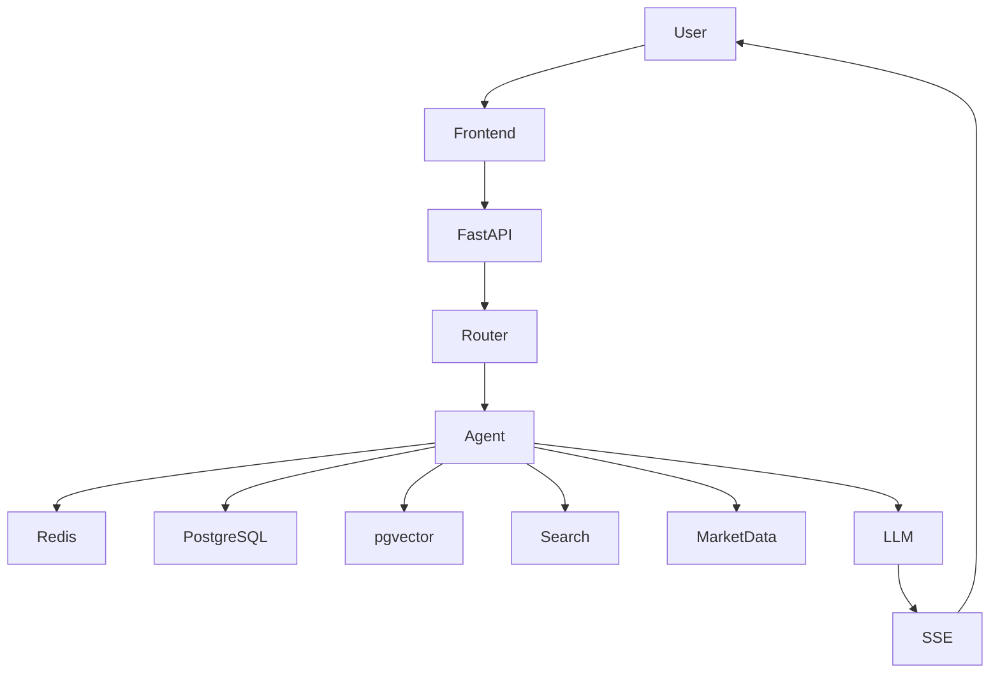