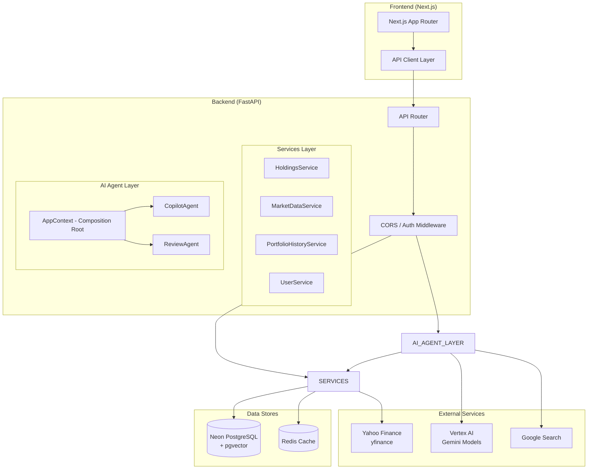
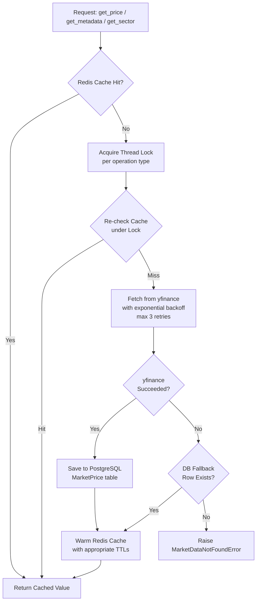
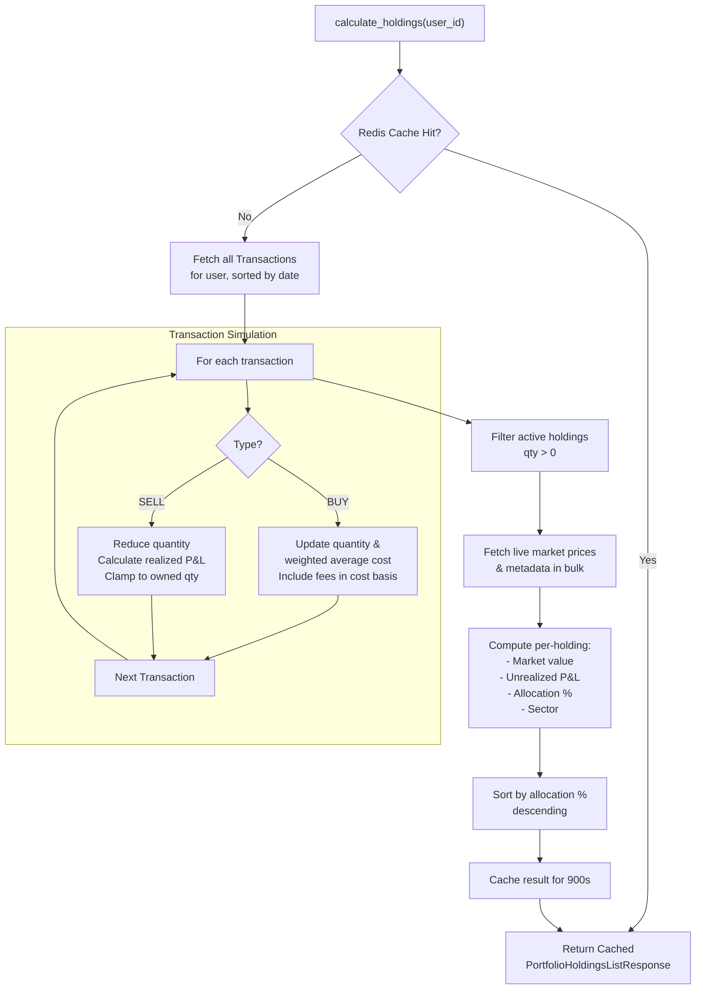
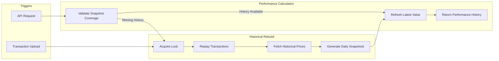
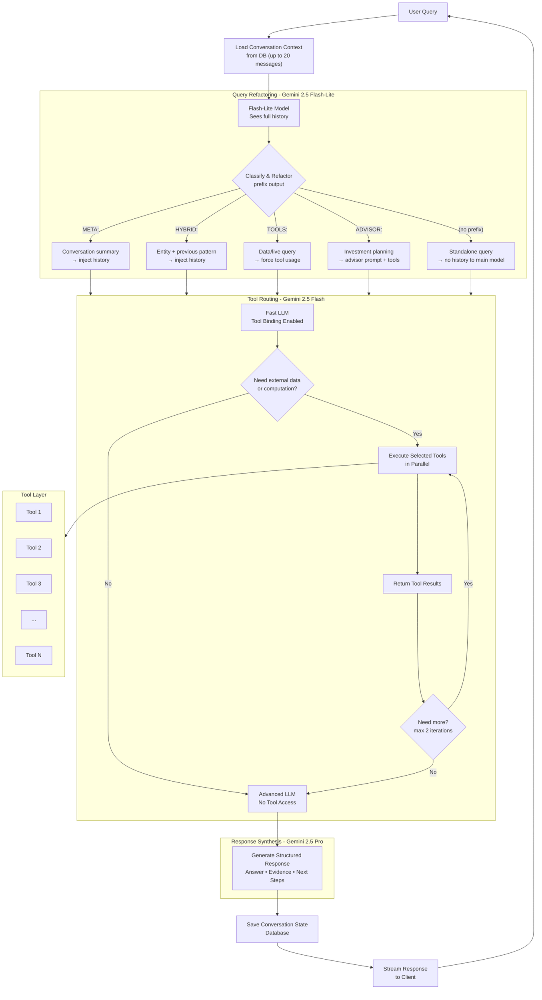
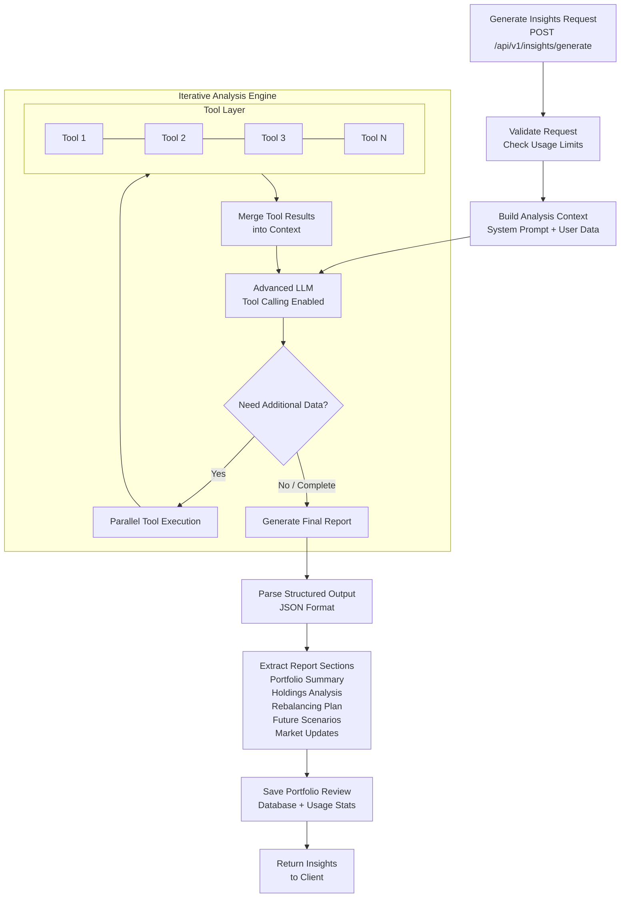
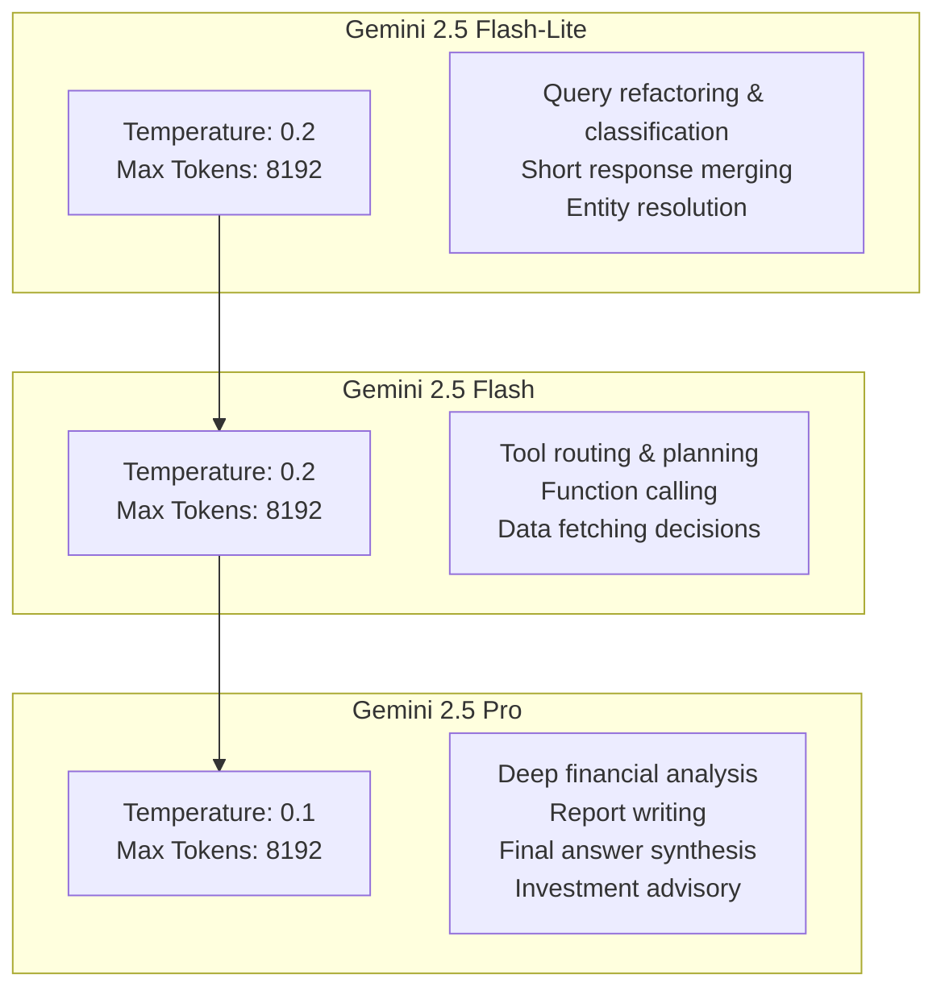
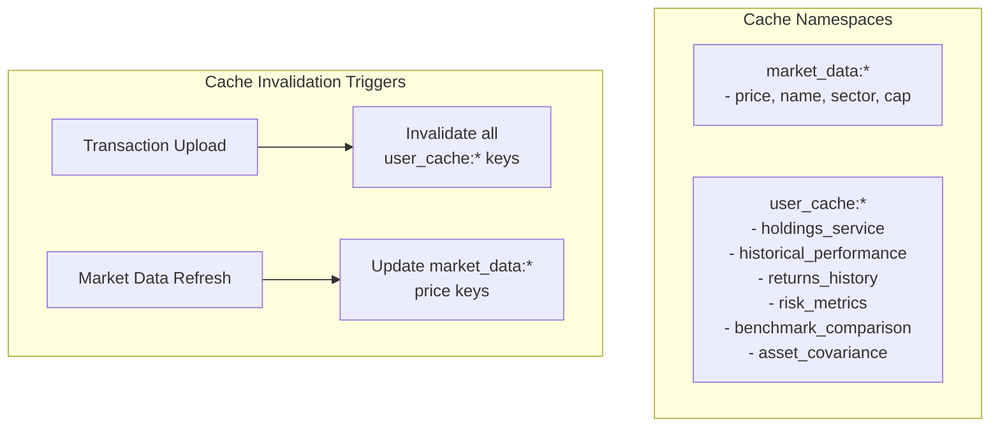
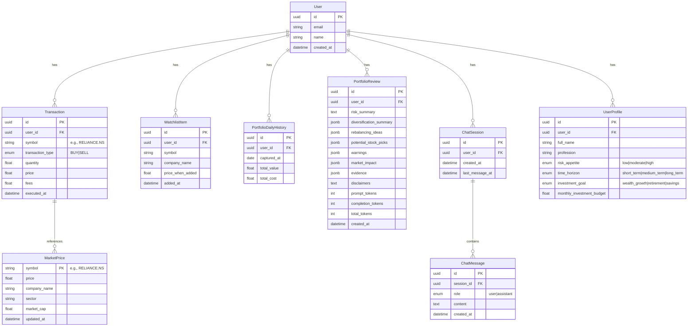

# NiveshIQ — AI Portfolio Intelligence Engine

NiveshIQ is an **AI-powered portfolio intelligence platform** that ingests stock transaction data, computes real-time portfolio analytics, and provides conversational AI insights via a multi-agent LangChain system powered by Google Vertex AI Gemini models.

---

## Table of Contents

1. [Tech Stack](#tech-stack)
2. [System Architecture](#system-architecture)
3. [Data Ingestion & Parsing Pipeline](#data-ingestion--parsing-pipeline)
4. [Market Data Service](#market-data-service)
5. [Holdings Calculation Engine](#holdings-calculation-engine)
6. [Portfolio History Service](#portfolio-history-service)
7. [Copilot Agent (Conversational AI)](#copilot-agent-conversational-ai)
8. [Review Agent (Portfolio Report Generation)](#review-agent-portfolio-report-generation)
9. [LLM & Tool Architecture](#llm--tool-architecture)
10. [API Endpoints](#api-endpoints)
11. [Scheduled Jobs](#scheduled-jobs)
12. [Authentication & Authorization](#authentication--authorization)
13. [Caching Strategy](#caching-strategy)
14. [Database Schema](#database-schema)

---

## Tech Stack

| Layer | Technology |
|-------|-----------|
| **Frontend** | Next.js 15 (App Router), TypeScript, Tailwind CSS |
| **Backend** | Python 3.11+, FastAPI, SQLAlchemy 2.0 |
| **Database** | Neon Serverless PostgreSQL + pgvector extension |
| **Cache** | Redis (via custom `cache_manager`) |
| **AI Models** | Google Vertex AI — Gemini 2.5 Flash-Lite, Flash, Pro |
| **AI Framework** | LangChain (`langchain-google-genai` with Vertex AI routing) |
| **Market Data** | Yahoo Finance (`yfinance`) |
| **Auth** | Neon Auth (cookie-based JWT) |
| **Deployment** | Backend: Vercel; Frontend: Vercel |

---

## System Architecture



---

## Data Ingestion & Parsing Pipeline

When a user uploads a stock transaction file (Excel/CSV), the following pipeline executes:

```mermaid
flowchart LR
    A[User Uploads<br/>Excel/CSV File] --> B[File Parsing<br/>extract_text / parsing utils]
    B --> C{File Type?}
    C -->|XLSX| D[OpenPyXL Parser]
    C -->|CSV| E[CSV Reader]
    D --> F[Normalize Columns<br/>symbol, qty, price, type, date]
    E --> F
    F --> G[Validate & Clean<br/>- Strip whitespace<br/>- Convert data types<br/>- Handle missing values]
    G --> H[Create Transaction Records<br/>in PostgreSQL]
    H --> I[Trigger History Rebuild<br/>PortfolioHistoryService.rebuild_history]
    I --> J[Invalidate Cache<br/>for holdings, history, risk metrics]
    J --> K[Return Parsed<br/>Transaction Summary]
```



**Key implementation details:**
- The parsing logic lives in `backend/app/utils/parsing.py` and handles both `.xlsx` and `.csv` formats
- Each transaction is stored as a `Transaction` model row with fields: `symbol`, `quantity`, `price`, `fees`, `transaction_type` (BUY/SELL), `executed_at`
- After successful parsing, `PortfolioHistoryService.rebuild_history()` is called to reconstruct the daily valuation timeline from scratch
- All cached analytics (holdings, returns, risk metrics) are invalidated so they recompute on next access

---

## Market Data Service

The `MarketDataService` is the backbone of all price and metadata resolution. It implements a **three-tier fallback hierarchy** with concurrent bulk operations and exponential backoff.



### Cache TTL Strategy

| Field | TTL | Rationale |
|-------|-----|-----------|
| `price` | 300s (5 min) | Changes intraday |
| `day_low` / `day_high` | 300s (5 min) | Changes intraday |
| `company_name` / `sector` | 31,536,000s (1 year) | Static metadata |
| `market_cap` | 2,592,000s (30 days) | Changes slowly |
| `52w_low` / `52w_high` | 2,592,000s (30 days) | Changes slowly |

### Concurrent Bulk Operations

For bulk requests (e.g., fetching prices for 20 holdings), the service:
1. Checks cache for each symbol individually
2. For cache misses, uses `yfinance` bulk download (`yf.download()`) with exponential backoff
3. Saves all fetched data to DB and cache in a single batch transaction
4. For symbols that still fail, falls back to a single DB batch SELECT query
5. Thread locks (`_bulk_price_lock`, `_metadata_lock`) prevent thundering herd problems

### yfinance Retry Logic

```python
max_attempts = 3
backoff_factor = 2.0
# Attempt 1: immediate
# Attempt 2: after 2s
# Attempt 3: after 4s
```

---

## Holdings Calculation Engine

The `HoldingsService.calculate_holdings()` method computes the user's current portfolio from their transaction history:



**Key calculations:**
- **Average buy price** = total cost (including fees) / total quantity (weighted average)
- **Realized P&L** = sell_qty × (sell_price − avg_cost) − fees
- **Unrealized P&L** = market_value − holding_cost
- **Allocation %** = market_value / total_portfolio_value × 100

---

## Portfolio History Service

The `PortfolioHistoryService` maintains a daily valuation timeline for each user. It is the most computationally intensive service and uses **PostgreSQL row-level locking** to prevent concurrent rebuild conflicts.



### Derived Analytics

The service computes these analytics from the daily history snapshots:

| Metric | Method | Description |
|--------|--------|-------------|
| **Returns History** | `get_returns_history()` | Daily values, costs, returns, cumulative return % |
| **Risk Metrics** | `calculate_risk_metrics()` | Sharpe ratio, Sortino ratio, volatility, max drawdown, VaR (95%/99%), CVaR |
| **Benchmark Comparison** | `compare_to_benchmark()` | Beta, Alpha, Correlation, Tracking Error, Information Ratio vs Nifty 50 |
| **Asset Covariance** | `calculate_asset_covariance()` | Covariance & correlation matrices for all active holdings |

**Risk-free rate used:** 6.5% annual (Indian context), converted to daily: 6.5% / 252

---

## Copilot Agent (Conversational AI)

The `CopilotAgent` is the conversational AI that answers user queries about their portfolio. It uses a **three-tier model architecture** with a query refactoring layer for robust multiturn handling.

### Three-Tier Architecture



### Query Refactoring Layer (New)

The **flash-lite model** acts as a dedicated query refactoring layer before any main model processing. It classifies each query into one of five types via a prefix system:

| Prefix | Meaning | History Injected? | Tools Forced? | Prompt Used |
|--------|---------|-------------------|---------------|-------------|
| `META:` | Conversation-about-itself ("summarize", "what did I ask") | ✅ | ❌ | AGENT_PROMPT |
| `HYBRID:` | Entity + previous pattern ("for TCS what you said earlier") | ✅ | ❌ | AGENT_PROMPT |
| `TOOLS:` | Data/live query ("what's the PE of HDFC Bank?") | ❌ | ✅ | AGENT_PROMPT |
| `ADVISOR:` | Investment planning ("create a plan for ₹10,000") | ❌ | ✅ | INVESTMENT_ADVISOR_PROMPT |
| *(none)* | Greetings, definitions, educational concepts | ❌ | ❌ | AGENT_PROMPT |

**Why this matters:** The main Flash/Pro models never see raw chat history for normal queries, preventing the hallucination where answering Q2 reproduces Q1's answer. Previous assistant answers are completely isolated from the inference context.

### Short Response / Clarification Handling

When the user provides a short confirmation response (e.g., "10000", "moderate", "yes"), the refactor layer uses the full chat history to **merge** this response into the original user intent, producing a complete standalone query. This handles multi-turn clarification flows naturally:

```
Turn 1: "Prepare plan for investing in individual stocks in Indian markets with ₹20k monthly budget"
Turn 2: "Medium risk and high growth"
→ Refactored: "Prepare an investment plan for individual stocks in Indian markets with 
   ₹20,000 monthly budget, medium risk tolerance, and high growth potential"
```

### Prompt Routing

Depending on the classification, the system selects the appropriate system prompt:
- **`AGENT_PROMPT`** — Default prompt for portfolio analysis, market data, and general financial queries
- **`INVESTMENT_ADVISOR_PROMPT`** — Expert advisor persona with structured investment planning workflow (profile understanding → actionable recommendations → risk management). Uses action-first output ordering and never explains generic financial concepts.

### Execution Flow (Detailed)

1. **History Loading**: Loads up to 20 most recent messages from the user's active `ChatSession`
2. **Query Refactoring (Flash-Lite)**: The cheap Flash-Lite model refactors (current query + history) into a standalone question, classified with a prefix
3. **Context Building**: `ContextManager.build_prompt()` assembles the appropriate system prompt + refactored query + tool results
4. **Tool Routing (Flash Model)**: The Flash model (with `bind_tools(TOOLS)`) decides whether to call tools or produce a direct answer
5. **Concurrent Execution**: Tool calls are executed in parallel via `ThreadPoolExecutor` (sync) or `loop.run_in_executor` (async streaming)
6. **Iteration**: Results are fed back to the Flash model for up to 2 iterations
7. **Final Synthesis (Pro Model)**: If tools were used, the Pro model synthesizes the gathered data into a structured JSON response
8. **Streaming**: For the streaming API, the response is parsed character-by-character to extract the `"answer"` field in real-time, handling escape sequences (`\n`, `\"`, etc.)

### Mandatory Tool Usage

When the refactor layer classifies a query as `TOOLS:` or `ADVISOR:`, a hard directive is injected into the prompt:

```
**MANDATORY TOOL USE:** This query was classified as needing current/live data.
Your training data is stale for this. You MUST call the relevant tools to fetch
up-to-date information before answering. Do NOT answer from memory.
```

This prevents the model from answering "recent news" queries from its training data instead of calling the news tools.


### Streaming Architecture

The `ask_copilot_stream()` method uses **Server-Sent Events (SSE)** with these event types:
- `data: {"type": "status", "text": "Thinking..."}`
- `data: {"type": "content", "text": "..."}` (streamed answer chunks)
- `data: {"type": "done", "payload": {...}}` (final structured payload)

---

## Review Agent (Portfolio Report Generation)

The `ReviewAgent` generates comprehensive portfolio review reports. Unlike the CopilotAgent, it uses a **single Pro model** with tool binding for all iterations:



### Report Structure

The generated report contains these sections:
- **portfolio_summary**: `current_value`, `total_pnl`, `total_pnl_percent`, `analysis` (strategic narrative)
- **holdings_analysis**: Per-holding analysis with action recommendations
- **rebalancing_plan**: Objective + step-by-step actions (BUY/SELL/REINVEST)
- **future_scenarios**: Market scenario projections
- **news_updates**: Relevant news items gathered via `google_web_search`
- **caveat**: Standard disclaimer text

Token usage (prompt, completion, total) is tracked and stored alongside the report.

---

## LLM & Tool Architecture

### Three-Tier Model Strategy



The three tiers are instantiated in `backend/app/core/llm.py`:
- `flash_lite_model` — Fastest, cheapest model for classification/refactoring
- `flash_model` — Tool routing and orchestration (bound with `bind_tools(TOOLS)`)
- `pro_model` — Final synthesis and deep analysis

### Tool Validation Decorator

Each tool is wrapped with the `@validate_tool` decorator that:
1. Validates input parameters against the Pydantic input schema
2. Executes the tool function
3. Validates the output against the Pydantic output schema
4. Wraps everything in a standardized `ToolResponseEnvelope`:
   ```json
   {
     "success": true/false,
     "timestamp": "2026-06-23T00:00:00Z",
     "source": "NiveshIQ",
     "data": { ... }
   }
   ```

---


## Authentication & Authorization

### Neon Auth Flow

1. User authenticates via **Neon Auth** (cookie-based JWT)
2. The `get_current_user` dependency extracts the JWT from cookies, validates it, and returns the `User` model
3. Guest users have a **token usage limit** enforced by `check_guest_token_limit()`

---

## Caching Strategy

The application uses **Redis** with a custom `cache_manager` for multi-layer caching:



| Cache Key Pattern | TTL | Invalidated When |
|-------------------|-----|------------------|
| `market_data:price:{symbol}` | 300s | On refresh |
| `market_data:name:{symbol}` | 1 year | Never (static) |
| `market_data:sector:{symbol}` | 1 year | Never (static) |
| `market_data:cap:{symbol}` | 30 days | On refresh |
| `user_cache:{user_id}:holdings_service` | 900s | On transaction upload |
| `user_cache:{user_id}:historical_performance` | 600s | On transaction upload |
| `user_cache:{user_id}:returns_history` | 600s | On transaction upload |
| `user_cache:{user_id}:risk_metrics` | 600s | On transaction upload |
| `user_cache:{user_id}:benchmark_comparison` | 600s | On transaction upload |
| `user_cache:{user_id}:asset_covariance` | 600s | On transaction upload |

---

## Database Schema

### Key Models



### pgvector Extension

The database uses the `pgvector` extension (enabled at startup via `CREATE EXTENSION IF NOT EXISTS vector;`) for future AI embedding capabilities.

---

## Key Design Patterns & Optimizations

### 1. Composition Root (`AppContext`)
The `AppContext` class acts as the composition root, wiring together all models, services, and agents. It creates singleton instances of:
- `CopilotAgent` (with Pro, Flash, and Flash-Lite models)
- `ReviewAgent` (receives the full `AppContext` for backward compatibility)

### 2. Query Refactoring Layer
A dedicated Flash-Lite model refactors (current query + history) into a standalone question before it reaches the main model pipeline. This:
- **Prevents multiturn hallucination** — main model never sees previous assistant answers for normal queries
- **Classifies queries** into META / HYBRID / TOOLS / ADVISOR / normal categories
- **Routes to appropriate prompts** — investment planning queries use the expert advisor persona
- **Merges short clarifications** — confirmation responses are seamlessly blended back into the original query context

### 3. Prompt Override Routing
`ContextManager.build_prompt()` accepts a `prompt_override` parameter, enabling the system to use different system prompts for different query types without changing the pipeline logic. Currently supports `AGENT_PROMPT` (default) and `INVESTMENT_ADVISOR_PROMPT` (for planning queries).

### 4. Mandatory Tool Enforcement
When `requires_tools=True`, a hard directive is injected into the prompt telling the model it MUST call tools rather than answering from memory — used for news, live pricing, and investment planning queries.

### 5. Concurrent Tool Execution
Both agents execute tool calls concurrently using `ThreadPoolExecutor`:
```python
with concurrent.futures.ThreadPoolExecutor(max_workers=len(tool_calls)) as pool:
    futures = {pool.submit(self._run_single_tool, tc, db, user_id): tc for tc in tool_calls}
```

### 6. PostgreSQL Row-Level Locking
The `rebuild_history()` method uses `SELECT ... FOR UPDATE` to prevent concurrent history rebuilds from conflicting:
```python
db.execute(text("SELECT id FROM users WHERE id = :user_id FOR UPDATE;"), {"user_id": user_id})
```

### 7. Exponential Backoff
All yfinance API calls use exponential backoff with a factor of 2.0 and max 3 attempts:
```python
sleep_time = backoff_factor * (2 ** attempt)  # 2s, 4s, 8s
```

### 8. SSE Streaming with Real-Time JSON Parsing
The copilot streaming endpoint parses the LLM's JSON output character-by-character to extract the `"answer"` field in real-time, handling escape sequences without waiting for the full response.

### 9. Cached Tool Bindings
- `_TOOL_MAP` is built once at module load (not per request)
- `_LLM_WITH_SEARCH` is bound once at module load for Google search
- `_flash_with_tools` and `_pro_no_tools` are cached on `CopilotAgent.__init__`

### 10. Profile Override Rule
In the investment advisor prompt, the user's stated intent in their query always overrides profile data from `get_user_profile`. Profile data is used silently as a fallback — never quoted or acknowledged if the user has already provided the value.

---

## Environment Variables

| Variable | Description |
|----------|-------------|
| `DATABASE_URL` | Neon PostgreSQL connection string |
| `VERTEX_PROJECT_ID` | GCP project ID for Vertex AI |
| `VERTEX_LOCATION` | GCP location (default: `us-central1`) |
| `GOOGLE_APPLICATION_CREDENTIALS` | GCP service account JSON (inline or file path) |
| `NEON_AUTH_BASE_URL` | Neon Auth base URL |
| `NEON_AUTH_COOKIE_SECRET` | Secret for signing auth cookies |
| `REDIS_URL` | Redis connection string |
| `ALLOWED_CORS_ORIGINS` | Comma-separated CORS origins |

---

## Running Locally

Config .env file in backend.

```bash
# Backend
cd backend
pip install -r requirements.txt
uvicorn app.main:app --reload

# Frontend
cd frontend
npm install
npm run dev
```
The backend runs on `http://localhost:8000` and the frontend on `http://localhost:3000`.

## IMPORTANT NOTES:

- The ChatBOT has certain limitations because of memory limit and limited tool supports. In future more tools will be added to make it robust.
- Currently there is noticeable delay in AI response which will be reduced in upcoming updates.
- The ChatBOT might hallucinate because of memory limit, in that case clear the history and try again.
- If the prompt generated is not satisfactory , try again after clearing history and re defining the prompt in detail